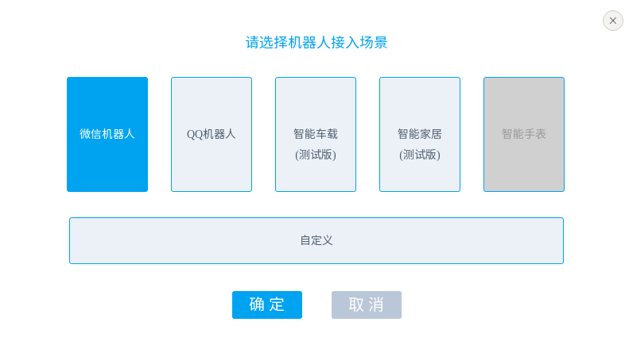
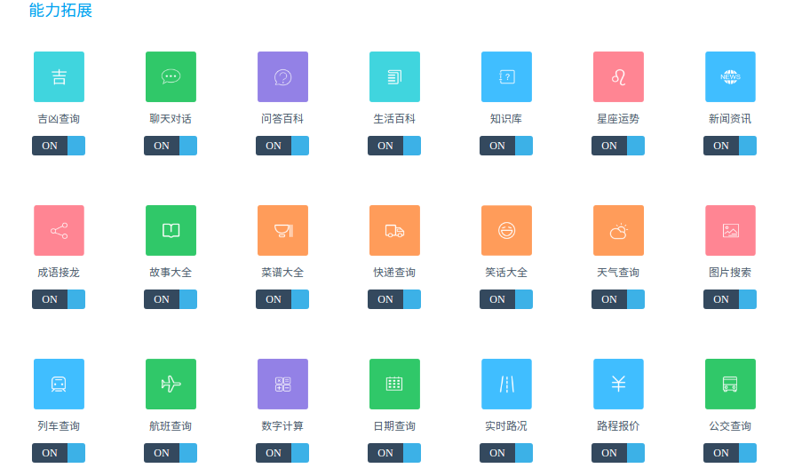
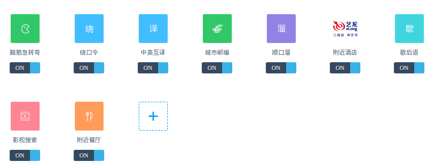
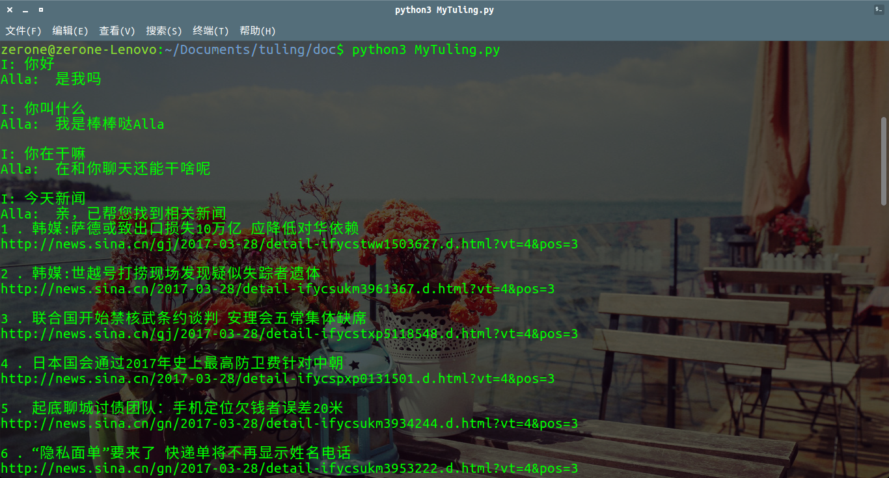
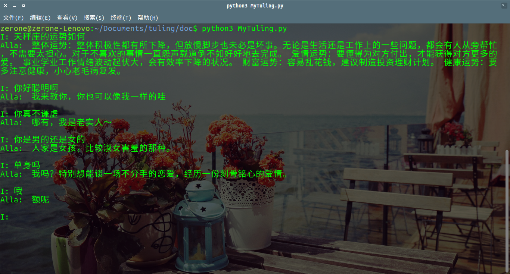

# Turing-Robot
基于 [图灵机器人](www.tuling123.com) 的字符界面聊天程序, 类似与 [微软小冰](http://baike.baidu.com/link?url=a9-Afrb6iFK3XJehS5RSmYlIbIok4XkRLkHRzKz4bBaqL5R7ypXxebU-YOCQQO-KOCeJX0FtxvsquoOefpbi8qDl_oSwQ8dykBdTyCe0-trhL-1E-NnS4rLkUJsGAXn0)。

A Chinese chat program with character interface based on tuling robot.

---
### 图灵机器人简介

> 图灵机器人，中文语境下智能度最高的机器人大脑。

在官网注册后，用户可以免费创建五个机器人

图灵机器人具有以下一些功能：

---
### 功能简介

**该程序基于官网提供的API和使用python3的requests库实现上述功能。**

** 个人觉得该程序还有极大的扩展性，例如添加一些关键词指令让该程序去调用其他程序、执行系统命令等，这样一来可以实现PC端上类似智能助手的功能。 **

运行截图：

---
### 使用须知
+ 该程序使用python3编写，使用了requests库（第三方库），因此运行前需要配置好相应环境
+ 运行程序**必须**要有  [图灵机器人](www.tuling123.com) 的**帐号**，并在个人中心创建并配置一个自定义机器人，获得**APIKEY**。
+ ** 运行前，使用文本编辑器打开turing.py文件，在里面填写帐号和APIKEY以及机器人的名字。**

---
### V 1.0 日志       ---- 2017.3.28

因为时间仓促， V1.0写的极为简陋，只具有最基本的功能，即简单地发送请求，对收到的json格式数据回复进行简单的处理后输出。后续会不断完善和增加新功能。

---
### 实现原理请戳 ----> [我的博客](fgksgf.me)

